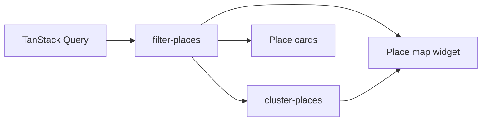

# 06-map-explorer architecture

Places explorer with TanStack Query for data and a CSS map mock with grid clustering.

```mermaid
flowchart LR
  query[TanStack Query]
  filter[filter-places]
  cluster[cluster-places]
  map[Place map widget]
  list[Place cards]
  query --> filter --> map
  filter --> list
  filter --> cluster --> map
```

Port **5006**; federation remote `mapExplorer/App`.
